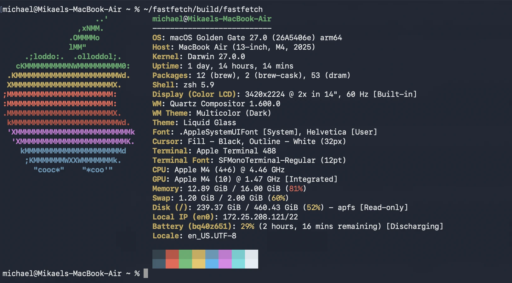

# dram 🥃

[](https://github.com/spoodyz/dram/actions/workflows/ci.yml)
[](LICENSE)

**A wee pour of Homebrew.** A fast, Homebrew-compatible package manager for
macOS, written in Rust. Installs the same bottles from the same registry —
with no Ruby, no taps, no git clone, and per-project locked environments
that brew architecturally can't do.


- **Fast where it counts** — parallel downloads and wave-scheduled parallel
  installs (~2× brew on cold installs), and ~0.07s for no-op/metadata
  operations where brew takes half a second or more (8×).
- **The whole homebrew-core catalog** — same formulae, same bottles, same
  versions, fetched from the same public API and registry brew uses.
- **Per-project environments** — `dram.toml` + `dram.lock` pin exact versions
  *and bottle digests*; `dram sync` reproduces the identical environment on
  another machine even after the formula index moves on. Ten projects locking
  jq share one keg.
- **Actually functional** — dependency-safe uninstall with autoremove,
  post-install steps interpreted natively, `upgrade`/`outdated`, `search`,
  Dramfile bundles, and a Cellar-wide `doctor`.
- **Honest scope** — bottles only. No casks (GUI apps), no source builds, no
  services. Brew still does those; dram does the daily 90% dramatically
  faster. Currently tested on Apple silicon.

## Install

Grab the prebuilt binary (Apple silicon):

```sh
curl -L https://github.com/spoodyz/dram/releases/latest/download/dram-macos-arm64.tar.gz | tar xz
./dram install jq   # dram adds itself-managed ~/.dram/bin to your PATH on first install
mv dram ~/.dram/bin/
```

Or build from source (needs Rust + Xcode CLT):

```sh
git clone https://github.com/spoodyz/dram && cd dram
cargo build --release
./target/release/dram install jq
cp target/release/dram ~/.dram/bin/
```

## Benchmarks

Same machine, same network, cold caches, brew with `HOMEBREW_NO_AUTO_UPDATE=1`
— its best case. (Default config periodically auto-updates, adding ~1s to the
first command whenever its API data is stale: measured 1.46s vs 0.53s on the
same no-op.)

| Operation | brew | dram | Speedup |
|---|---|---|---|
| Cold install: wget tree (5–6 formulae) | 6.2s | 3.7s | 1.7× |
| Cold install: ffmpeg tree (13 formulae) | 6.4s | 3.3s | 1.9× |
| No-op install (already installed) | 0.57s | 0.07s | 8× |
| Uninstall ffmpeg tree + autoremove | 1.5s | 0.3s | 4.6× |

dram's installs do the full functional work: dependency resolution, keg-only
handling, Mach-O relocation + re-signing, post-install steps, receipts.

## How it works

Two public endpoints are everything:

- `https://formulae.brew.sh/api/formula.json` — every formula's metadata,
  deps, versions, and bottle URLs in one JSON dump (cached 24h locally).
- `ghcr.io` — bottles are plain OCI blobs; anonymous pulls with the same
  `Bearer QQ==` token brew itself uses.

## How an install works

```
dram install jq
  1. api.rs       fetch/cache formula.json, index by name + aliases
  2. resolver.rs  post-order DFS over runtime deps -> install order
  3. bottle.rs    pick platform tag, parallel-download blobs, verify sha256
  4. install.rs   extract tarball into ~/.dram/Cellar/<name>/<version>
  5. relocate.rs  rewrite @@HOMEBREW_PREFIX@@ placeholders:
                    - Mach-O load commands via otool + install_name_tool,
                      then codesign -f -s -  (edits invalidate signatures;
                      unsigned binaries are SIGKILLed on Apple silicon)
                    - text files (.pc, scripts, cmake) via string replace
  6. install.rs   symlink opt/<name> -> keg (install names resolve through
                  this), and keg/bin/* -> ~/.dram/bin unless keg-only
```

Everything lands under `~/.dram` (override with `--prefix`), so no sudo and
no fights with an existing brew in `/opt/homebrew`.

```
dram install <names...>   # install with deps
dram info <name>          # version, deps, bottle availability
dram deps <name>          # resolved install order
dram list                 # installed kegs
dram uninstall <names...> # remove kegs + links; refuses if something still
                          # depends on them, autoremoves orphaned deps
dram update               # force-refresh the index
dram search <term>        # find formulae by name or description
dram outdated             # what has a newer version
dram upgrade [names...]   # upgrade named formulae, or everything outdated
dram doctor               # verify links, dylib resolution, signatures
dram bundle [file]        # install everything in a Dramfile (one name/line)
dram bundle --dump        # write your explicitly-installed set to a Dramfile
```

After a successful install, dram checks whether `<prefix>/bin` is on your
PATH and, if not, appends an export line to your shell profile
(`~/.zshrc` for zsh, `~/.bash_profile` for bash) — idempotently, marked
`# added by dram`. Open a new shell to pick it up.

## Known v1 limits (deliberate)

- **Relocation is placeholder-only.** Bottles whose `cellar` field is an
  absolute path have the build prefix baked in beyond load commands
  (compiled-in resource paths etc.); those may misbehave outside
  `/opt/homebrew`. `dram info` shows the cellar field so you can tell.
- **Platform tag choice is a static preference list**, not real OS-version
  compatibility logic.
- **Only `bin` is linked.** No lib/include/share linking; build-time
  consumers should use `~/.dram/opt/<name>/...` paths.
- **Shells out to Xcode's otool / install_name_tool / codesign.** Replace
  with `goblin` + in-process signing later if the fork-per-binary cost shows.
- **No casks.** GUI apps are a different project.

## Per-project environments

The thing brew architecturally can't do. Kegs are relocated with
**version-pinned dylib paths** (`Cellar/<dep>/<version>/lib/...`, not the
mutable `opt/` link), which makes them immutable artifacts — any number of
versions coexist in the shared Cellar, and installing or upgrading one
thing can never break another. An environment is just symlinks on top:

```
dram init jq zstd     # write dram.toml
dram lock             # pin exact versions + bottle sha256s -> dram.lock
dram sync             # pour anything missing, materialize ./.dram/bin
dram shell            # subshell with the env on PATH (DRAM_ENV set)
eval "$(dram env)"    # or wire it into direnv
```

The lockfile records every platform tag's bottle digest, and sync fetches
by locked URL + sha256 — so a lockfile committed today reproduces the same
environment on another machine even after the formula index moves on.
Commit `dram.toml` + `dram.lock`; gitignore `.dram/`.

## Post-install

Homebrew exposes `post_install_steps` as declarative JSON in the API, and
dram interprets them natively (no Ruby): filesystem verbs (mkdir_p, symlink,
copy, write, inreplace, ...), `run` with env/chdir, gzipped-executable
installs, data-dir init, and the GUI cache helpers when their tools are
present. Step problems surface as warnings, never failed installs. The only
skips are the Linux/exotic ones (gcc/glibc/llvm runtime config, php,
python ≤3.11 bootstrap — modern python@3.12+ works fully); those warn
honestly. Steps are pinned into `dram.lock` so env syncs replay them.

## Under the hood

Installs are wave-scheduled: bottles download 6-way parallel, and each keg
pours (extract -> relocate -> re-sign -> post-install) the moment its own
download and its deps are done — independent DAG branches pour concurrently
(4-way), overlapping the remaining downloads. Writes to the shared bin/opt
namespaces are serialized; everything keg-local runs parallel.

Upgrades respect version pinning: a new version pours alongside the old,
and the old keg is deleted only when no other keg could still pin it —
dependents keep working until their own (revision-bumped) upgrade re-pours
them. `cargo test` covers the resolver, relocation substitution, glob
expansion, and Dramfile parsing.

## Seen in the wild

fastfetch support is [in review](https://github.com/fastfetch-cli/fastfetch/pull/2515):



## Roadmap

- casks (GUI apps)
- source builds for bottle-less formulae
- parallel per-file relocation within a keg
- services (launchd management)
